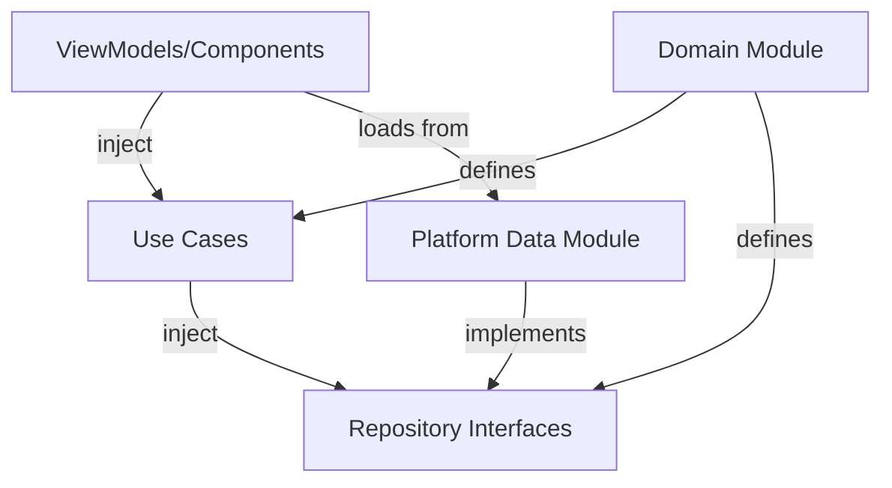

# Data Model: Koin DI Module Structure

**Feature**: Koin DI for Kotlin Multiplatform  
**Date**: 2025-11-17  
**Phase**: 1 - Design

## Overview

This document defines the structure and relationships of Koin dependency injection modules across all KMP platforms. It describes the module hierarchy, dependency flow, and entity relationships within the DI system.

## Module Architecture

### Module Hierarchy

```
┌─────────────────────────────────────────────────┐
│         Platform Application Entry              │
│  (PetSpotApplication / PetSpotApp / index.tsx) │
│                    startKoin()                  │
└──────────────────┬──────────────────────────────┘
                   │ initializes
                   ▼
┌─────────────────────────────────────────────────┐
│              Koin Container                     │
│  (Single shared instance across platform)      │
└──────────┬──────────────────────┬───────────────┘
           │                      │
           ▼                      ▼
┌──────────────────────┐  ┌──────────────────────┐
│   Domain Module      │  │  Platform Modules    │
│  (shared/commonMain) │  │  (platform-specific) │
│                      │  │                      │
│  - Use Cases         │  │  Android:            │
│  - Domain Services   │  │    - Data Module     │
│  - Validators        │  │    - ViewModel Mod.  │
│                      │  │                      │
│                      │  │  iOS:                │
│                      │  │    - Data Module     │
│                      │  │    (Swift wrappers)  │
│                      │  │                      │
│                      │  │  Web:                │
│                      │  │    - Data Module     │
│                      │  │    (TS wrappers)     │
└──────────────────────┘  └──────────────────────┘
```

### Dependency Flow

```
Platform-Specific Code (ViewModels, Components)
       ↓ depends on
Use Cases (Domain Module)
       ↓ depends on
Repository Interfaces (Domain Module)
       ↑ implemented by
Repository Implementations (Platform Data Modules)
```

---

## Module Entities

### 1. Domain Module

**Location**: `/shared/src/commonMain/kotlin/com/intive/aifirst/petspot/di/DomainModule.kt`

**Purpose**: Centralized module containing platform-agnostic dependencies (use cases, domain services, validators)

**Entity Definition**:
```kotlin
/**
 * Domain module containing shared business logic dependencies.
 * Available to all platforms (Android, iOS, Web).
 * 
 * Contains:
 * - Use cases for business operations
 * - Domain services (validators, formatters)
 * - Domain-level singletons
 */
val domainModule = module {
    // Example (to be added in future features):
    // single { GetPetsUseCase(get()) }
    // single { SavePetUseCase(get()) }
    // factory { PetValidator() }
}
```

**Properties**:
- **Name**: `domainModule`
- **Type**: Koin Module
- **Scope**: Global (singleton instance)
- **Platform Availability**: All (Android, iOS, Web)
- **Dependencies**: None (shared module has no platform dependencies)
- **Consumers**: Platform-specific ViewModels, components

**Lifecycle**: Created once at app startup, lives for entire application lifetime

**Validation Rules**:
- MUST NOT contain UI code
- MUST NOT contain ViewModels
- MUST NOT contain platform-specific implementations
- MUST contain only pure Kotlin code (no Android/iOS/JS APIs)

---

### 2. Android Data Module

**Location**: `/composeApp/src/androidMain/kotlin/com/intive/aifirst/petspot/di/DataModule.kt`

**Purpose**: Android-specific data layer dependencies (repository implementations, API clients, databases)

**Entity Definition**:
```kotlin
/**
 * Android data module providing platform-specific repository implementations.
 * 
 * Contains:
 * - Repository implementations (implementing shared interfaces)
 * - API clients (Retrofit, Ktor, etc.)
 * - Database instances (Room, SQLDelight)
 * - Data sources
 */
val androidDataModule = module {
    // Example (to be added in future features):
    // single<PetRepository> { PetRepositoryImpl(get(), get()) }
    // single { PetApi(get()) }
    // single { PetDatabase.getInstance(androidContext()) }
}
```

**Properties**:
- **Name**: `androidDataModule`
- **Type**: Koin Module
- **Scope**: Global (singleton instance)
- **Platform Availability**: Android only
- **Dependencies**: 
  - Android Context (via `androidContext()`)
  - Shared repository interfaces (from domain module)
- **Consumers**: Use cases (via interface injection)

**Lifecycle**: Created once at app startup (in `Application.onCreate()`), lives for entire application lifetime

**Validation Rules**:
- MUST implement interfaces from shared module
- MAY use Android-specific APIs (Context, Android SDK)
- MUST provide singleton implementations for repositories
- MUST handle Android-specific concerns (lifecycle, Context)

---

### 3. Android ViewModel Module

**Location**: `/composeApp/src/androidMain/kotlin/com/intive/aifirst/petspot/di/ViewModelModule.kt`

**Purpose**: Android ViewModels with injected dependencies

**Entity Definition**:
```kotlin
/**
 * Android ViewModel module.
 * 
 * Contains:
 * - ViewModels for Jetpack Compose screens
 * - Scoped to ViewModel lifecycle (auto-cleared)
 */
val androidViewModelModule = module {
    // Example (to be added in future features):
    // viewModel { PetListViewModel(get()) }
    // viewModel { PetDetailViewModel(get(), get()) }
}
```

**Properties**:
- **Name**: `androidViewModelModule`
- **Type**: Koin Module
- **Scope**: ViewModel lifecycle (scoped instances)
- **Platform Availability**: Android only
- **Dependencies**: 
  - Use cases from domain module
  - Android-specific services
- **Consumers**: Compose screens (via `koinViewModel()`)

**Lifecycle**: Created when ViewModel requested, destroyed when ViewModel cleared

**Validation Rules**:
- MUST use `viewModel { }` scope (not `single { }`)
- MUST NOT hold Android Context (ViewModels should be lifecycle-aware but Context-free)
- SHOULD depend on use cases, not repositories directly

---

### 4. iOS Data Module

**Location**: `/iosApp/iosApp/DI/IosDataModule.swift` (Swift wrapper) + Koin module in shared

**Purpose**: iOS-specific data layer dependencies (repository implementations)

**Entity Definition** (Kotlin/Native):
```kotlin
// /shared/src/iosMain/kotlin/.../di/IosDataModule.kt
val iosDataModule = module {
    // Example (to be added in future features):
    // single<PetRepository> { IosPetRepositoryImpl() }
}
```

**Swift Access Pattern**:
```swift
// /iosApp/iosApp/DI/KoinInitializer.swift
func initKoin() {
    KoinKt.doInitKoin()
}

// Swift ViewModel consuming Koin
class PetListViewModel: ObservableObject {
    private let getPetsUseCase: GetPetsUseCase
    
    init(getPetsUseCase: GetPetsUseCase = KoinKt.get()) {
        self.getPetsUseCase = getPetsUseCase
    }
}
```

**Properties**:
- **Name**: `iosDataModule` (optional - can be part of domainModule)
- **Type**: Koin Module (Kotlin/Native)
- **Scope**: Global (singleton instance)
- **Platform Availability**: iOS only
- **Dependencies**: Shared repository interfaces
- **Consumers**: Swift ViewModels (via `KoinKt.get()`)

**Lifecycle**: Created once at app startup, lives for entire application lifetime

**Validation Rules**:
- MUST implement interfaces from shared module
- MAY use iOS-specific APIs (UIKit, Foundation)
- MUST be accessible from Swift via Kotlin/Native interop

---

### 5. Web Data Module

**Location**: `/webApp/src/di/koinSetup.ts` (TypeScript wrapper)

**Purpose**: Web-specific data layer dependencies (repository implementations using Kotlin/JS)

**Entity Definition** (TypeScript):
```typescript
// /webApp/src/di/koinSetup.ts
import { startKoin, domainModule } from 'shared'; // Kotlin/JS exports

/**
 * Initialize Koin DI for web platform.
 * Consumes shared domain module from Kotlin/JS.
 */
export function initializeKoin() {
    startKoin({
        modules: [domainModule]
        // Web-specific modules can be added here in future
    });
}
```

**React Hook Pattern**:
```typescript
import { get } from 'shared'; // Kotlin/JS Koin helper

export function usePets() {
    const getPetsUseCase = get<GetPetsUseCase>();
    
    const [pets, setPets] = useState<Pet[]>([]);
    
    useEffect(() => {
        getPetsUseCase.invoke().then(setPets);
    }, []);
    
    return { pets };
}
```

**Properties**:
- **Name**: Web DI setup (no named module - uses shared domainModule)
- **Type**: TypeScript initialization function
- **Scope**: Global (initialized once)
- **Platform Availability**: Web only
- **Dependencies**: Shared domain module (Kotlin/JS)
- **Consumers**: React components and hooks

**Lifecycle**: Initialized once before React app renders, lives for entire session

**Validation Rules**:
- MUST initialize Koin before React app renders
- MAY add web-specific modules in future
- SHOULD consume shared modules via Kotlin/JS exports

---

## Dependency Scopes

### Singleton Scope

**Keyword**: `single { }`

**Use Cases**:
- Repositories (one instance shared across app)
- API clients (network singletons)
- Database instances (one DB connection pool)
- Use cases (stateless business logic)

**Example**:
```kotlin
val domainModule = module {
    single { GetPetsUseCase(get()) }
    single<PetRepository> { PetRepositoryImpl(get()) }
}
```

**Lifecycle**: Created on first request, lives until `stopKoin()` called (app termination)

---

### Factory Scope

**Keyword**: `factory { }`

**Use Cases**:
- Validators (lightweight, no state)
- Formatters (pure functions)
- Request builders (short-lived objects)

**Example**:
```kotlin
val domainModule = module {
    factory { PetValidator() }
    factory { DateFormatter() }
}
```

**Lifecycle**: Created new on each `get()` request, garbage collected when no longer referenced

---

### ViewModel Scope (Android Only)

**Keyword**: `viewModel { }`

**Use Cases**:
- Android ViewModels (Jetpack Compose / XML views)

**Example**:
```kotlin
val androidViewModelModule = module {
    viewModel { PetListViewModel(get()) }
}
```

**Lifecycle**: Created when requested, destroyed when ViewModel cleared (screen navigation, configuration change survival)

---

## State Transitions

### Koin Lifecycle State Machine

```
┌─────────────┐
│  NOT_STARTED│
└──────┬──────┘
       │ startKoin()
       ▼
┌─────────────┐
│  STARTED    │◄────┐
└──────┬──────┘     │
       │ get()      │ loadModules()
       ▼            │
┌─────────────┐     │
│  RUNNING    │─────┘
└──────┬──────┘
       │ stopKoin()
       ▼
┌─────────────┐
│  CLOSED     │
└─────────────┘
```

**State Descriptions**:
1. **NOT_STARTED**: Initial state before `startKoin()` called
2. **STARTED**: Modules loaded, container ready
3. **RUNNING**: Dependencies being resolved actively
4. **CLOSED**: Koin stopped (app termination)

**Invalid Transitions**:
- ❌ `get()` before `startKoin()` → Error: "KoinApplication has not been started"
- ❌ `startKoin()` twice → Error: "A Koin Application has already been started"

---

## Module Relationships

### Dependency Graph



**Relationships**:
1. **Domain Module** defines use cases and repository interfaces
2. **Platform Data Modules** implement repository interfaces
3. **ViewModels/Components** depend on use cases (injected from Domain Module)
4. **Use Cases** depend on repository interfaces (implementations provided by Platform Data Modules)

---

## Error Handling

### Missing Dependency Error

**Scenario**: Dependency requested but not registered

**Example**:
```kotlin
val domainModule = module {
    single { GetPetsUseCase(get()) } // get() tries to resolve PetRepository
}

// PetRepository not defined → Error at runtime
```

**Error Message**:
```
org.koin.core.error.NoBeanDefFoundException: 
No definition found for type 'PetRepository'. 
Check your module definitions.
```

**Resolution**: Register missing dependency in appropriate module

---

### Circular Dependency Error

**Scenario**: A depends on B, B depends on A

**Example**:
```kotlin
val brokenModule = module {
    single { ServiceA(get<ServiceB>()) }
    single { ServiceB(get<ServiceA>()) }
}
```

**Error Message**:
```
org.koin.core.error.DefinitionOverrideException:
Circular dependency detected: ServiceA -> ServiceB -> ServiceA
```

**Resolution**: Refactor to break circular dependency (use interface, mediator pattern, or lazy initialization)

---

### Module Override Error

**Scenario**: Same dependency defined twice

**Example**:
```kotlin
val module1 = module {
    single<PetRepository> { Impl1() }
}
val module2 = module {
    single<PetRepository> { Impl2() }
}
startKoin { modules(module1, module2) } // Error
```

**Error Message**:
```
org.koin.core.error.DefinitionOverrideException:
Definition for 'PetRepository' already exists
```

**Resolution**: Use `override = true` parameter if intentional, otherwise remove duplicate definition

---

## Testing Support

### Test Module Override

**Pattern**: Replace production dependencies with test doubles

**Example**:
```kotlin
class GetPetsUseCaseTest : KoinTest {
    @Before
    fun setup() {
        startKoin {
            modules(module {
                // Override with fake repository
                single<PetRepository> { FakePetRepository() }
                single { GetPetsUseCase(get()) }
            })
        }
    }
    
    @After
    fun tearDown() {
        stopKoin()
    }
}
```

**Benefits**:
- Tests run in isolation (no real network/database)
- Fast test execution
- Predictable test data

---

## Future Extensions

### Planned Enhancements (Out of Scope for MVP)

1. **Custom Scopes**: Screen-scoped, session-scoped dependencies
   ```kotlin
   scope<PetListActivity> {
       scoped { PetListState() }
   }
   ```

2. **Named Dependencies**: Multiple implementations of same interface
   ```kotlin
   single<PetRepository>(named("local")) { LocalPetRepository() }
   single<PetRepository>(named("remote")) { RemotePetRepository() }
   ```

3. **Module Composition**: Splitting domain module into sub-modules
   ```kotlin
   val petModule = module { /* pet-related dependencies */ }
   val userModule = module { /* user-related dependencies */ }
   val domainModule = listOf(petModule, userModule)
   ```

---

## Summary

This data model defines:
- **5 module entities**: Domain, Android Data, Android ViewModel, iOS Data, Web setup
- **3 dependency scopes**: Singleton, Factory, ViewModel
- **Clear dependency flow**: Platform → Use Cases → Interfaces ← Implementations
- **Error handling**: Missing dependency, circular dependency, override errors
- **Testing strategy**: Module override for test doubles

**Next Steps**: Generate API contracts (`contracts/`) and quickstart guide (`quickstart.md`)

